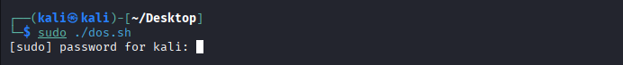
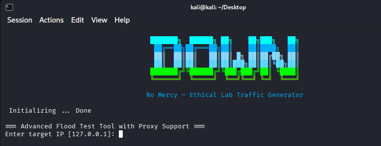
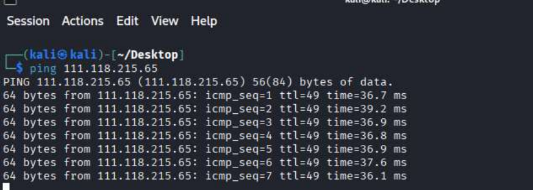
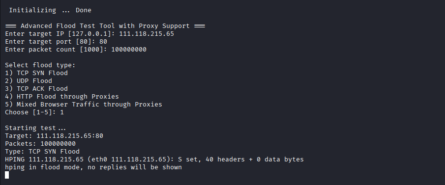
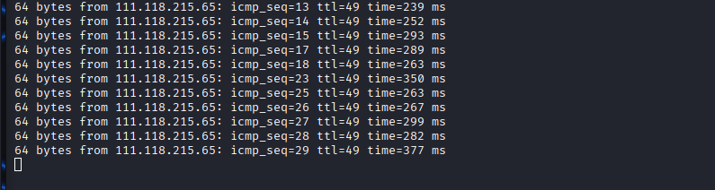

# DOWN — NoMercy: The Ethical Lab Traffic Generator

<p align="center">
  
  
  
  
</p>

---

## Overview

**DOWN** is an **educational, lab-only traffic generator** designed to simulate various network traffic patterns in a controlled environment.  
It helps security students, researchers, and developers test monitoring, packet handling, and traffic analysis within an isolated lab.

> ⚠ **Warning:** This tool is for **lab-only, authorized testing**. Do **not** use against external networks or systems you do not own or have explicit written permission to test.

---

<p align="center">  </p>

## Table of Contents

- [Overview](#overview)
- [Features](#features)
- [Prerequisites](#prerequisites)
- [Getting Started](#getting-started)
- [Screenshots](#screenshots)
- [Contributing](#contributing)

---

## Features

- **Interactive Banner:** Animated terminal banner on script launch.
- **Traffic Simulation Modes:**
  1. TCP SYN Flood
  2. UDP Flood
  3. TCP ACK Flood
  4. HTTP Flood through Proxies
  5. Mixed Browser Traffic via Proxies
- **Customizable Input:** Target IP, port, and packet/request count.
- **Proxy Support:** Simulates traffic through multiple lab proxies.
- **Safety Documentation:** Step-by-step instructions for controlled testing.

---

## Prerequisites

- Linux-based OS (Ubuntu, Kali, Debian, etc.)
- Bash shell
- `hping3` installed
- `nc` (netcat) installed
- Administrative privileges on the tester machine
- Isolated lab network environment

---

## Getting Started

1. **Clone the repository**:
   ```bash
   git clone https://github.com/dhruvil-84/DOWN-NoMercy.git
   cd DOWN-NoMercy
   ```
2. **Install Dependencies**:
   ```bash
   sudo apt update
   sudo apt install hping3 netcat
   ```
3. **Give Executable Permission**:
   ```bash
   chmod 777 dos.sh
   ```
4. **Run the script**:
   ```bash
   sudo ./dos.sh
   ```
5. **Follow the prompts**:
   - Enter target IP (lab VM or localhost)
   - Enter target port
   - Enter packet/request count
   - Select traffic type (1–5)
6. **Monitor and document results in lab environment.**
---

## Screenshots

<p align="center">  </p>
<p align="center">  </p>
<p align="center">  </p>
<p align="center">  </p>
<p align="center">  </p>

---

## Contributing

**Contributions are welcome for**:
- Documentation improvements
- Lab-only feature enhancements
- Defensive analysis and monitoring tips

**Please fork the repository and submit a pull request.**

---
